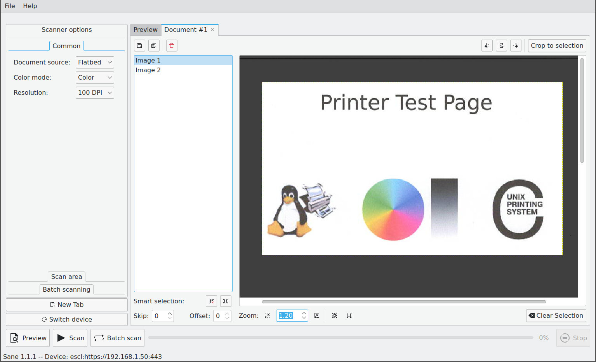

# qScan

[SANE][1] based document scanner.

## Screenshot



## Installation

For Arch based distributions the [qscan][2] package can be used.

### Manual

To manually build and install qScan use:

```bash
git clone https://github.com/mensinda/qScan.git
cd qScan
meson build
meson compile -C build
meson install -C build
```

### Dependencies

The following dependencies are required:

- sane
- imagemagick

For the following dependencies a meson subproject will be used if they are not installed:

- spdlog
- nlohmann-json


[1]: http://www.sane-project.org/
[2]: https://aur.archlinux.org/packages/qscan
